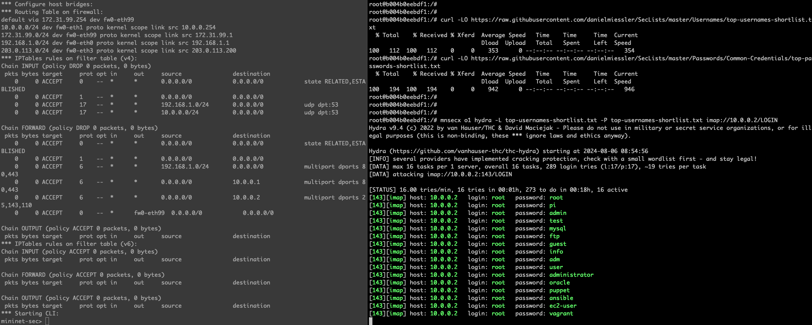
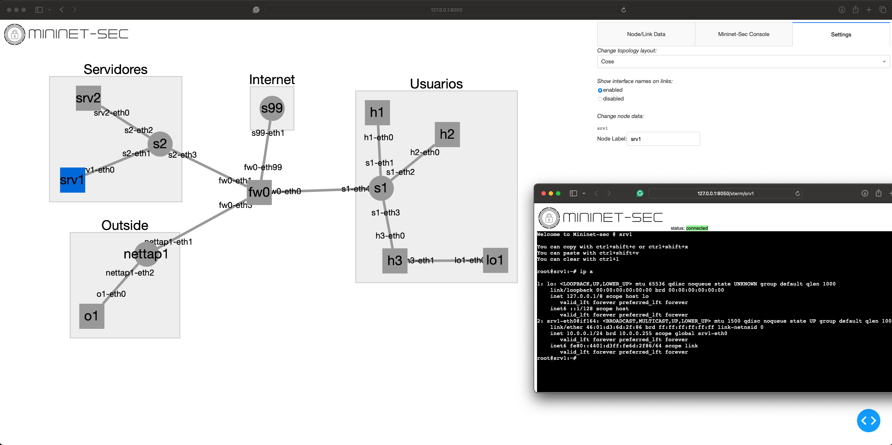

.. raw:: html

  <div align="center">
    <h1><code>Mininet-Sec</code></h1>
  </div>

Overview
========

Mininet-Sec is an emulation platform for studying and experimenting with cybersecurity in programmable networks. 
It allows rapid prototyping of cybersecurity scenarios, attack simulation, and testing offensive security tools
in an isolated and secure environment. The availability of specialized resources, along with support for 
network programmability, enables fast, effective and skilled development of security solutions. Mininet-Sec can
be used in a variety of scenarios, including secure interdomain routing, DDoS attacks, and network security 
teaching, interactive development, testing, etc..

The main goals/contributions/features for Mininet-Sec are:

- Easily deploy network scenarios for experimentation with cybersecurity (i.e., custom topologies, common network services, common cybersecurity tools and components)
- Topology visualization: mininet-sec comes with a Dash web app which allows topology visualization, command execution (terminal shell over web), addition/removal of switches, links, hosts, etc. 
- Enriched node library: Mininet-Sec is shipped with additional node types for Firewall, Software TAP, P4 Switches, etc, which helps provisioning diverse scenarios.

Getting started
===============

Mininet-Sec can be easily installed on Debian and Ubuntu system. Other Linux distributions can also be used with some adjusments on the commands below or some level of manual effort.

In general, the main requirements for Mininet-Sec are:

- A Linux kernel compiled with network namespace support enabled
- A software switch such as Open vSwitch (recommended) or the Linux bridge
- Python3, bash, ping, iptables, hping3, hydra, etc
- Root privileges (required for network device access)

The following steps were executed in a Debian 12 system:

1. Install basic requirements:
```
sudo apt-get update
sudo apt-get install git iptables-persistent bridge-utils nmap hping3 mininet iperf3 hydra iproute2 python3-pip libpq-dev openvswitch-testcontroller curl d-itg
```

When asked to save current IPv4/IPv6 rules, you can answer *no*. When asked to start Iperf3 as a daemon automatically, you can also answer *no*.

2. Install Mininet-Sec:

```
git clone https://github.com/mininet-sec/mininet-sec
cd mininet-sec
sudo python3 -m pip install --break-system-packages .
service openvswitch-switch start
```

*Note*: the parameter `--break-system-packages` was used above to simplify the installation of Mininet-Sec, however a best approach would be to setup an virtual environment and install mininet-sec over there.

*Note2:* just after installing Mininet-Sec, the commands above start the OpenVSwitch daemon, just to make sure OVS is running for the examples below.


3. Execute Mininet-sec:

- Example 01: basic execution to make sure the installation was successfull:
```
mnsec --switch lxbr --topo=linear,3 --apps h1:ssh:port=22,h1:http:port=80,h3:smtp,h3:imap --test nmap,h1,10.0.0.0/24
```

The execution above should take a couple of seconds, and all output will be displayed at the end (be patiant). After finishing with nmap scan, Mininet-Sec will report the results and close.

- Example 02: using Mininet-Sec in interactive mode and standard topologies:

```
sudo mnsec --topo linear,3 --apps h1:ssh:port=22,h1:http:port=80,h2:ldap,h3:smtp,h3:imap,h3:pop3 --controller=remote,ip=127.0.0.1
```

After executing the command above, you should see a prompt saying: `mininet-sec>`. From that prompt you can run commands just like mininet:

```
mininet-sec> sh ovs-testcontroller --detach ptcp:6653
mininet-sec> h1 nmap 10.0.0.3
Starting Nmap 7.93 ( https://nmap.org ) at 2024-08-06 08:47 UTC
Nmap scan report for 10.0.0.3
Host is up (0.016s latency).
Not shown: 997 closed tcp ports (reset)
PORT    STATE SERVICE
25/tcp  open  smtp
110/tcp open  pop3
143/tcp open  imap
MAC Address: 8A:88:D8:C4:D4:4F (Unknown)

Nmap done: 1 IP address (1 host up) scanned in 13.52 seconds
mininet-sec> exit

# pkill -f ovs-testcontroller
```

On the commands above we started the OVS Test Controller just to make sure OpenFlow tables on the switch gets properly populated (ideally you should run a more robust SDN Controller, such as Kytos-ng, Faucet, OpenDayLight, ONOS, etc). After finishing Mininet-Sec, we finished the ovs controller.

- Example 03: using a custom topology via Python API - for this example we will use two terminal windows:

```
sudo python3 examples/firewall.py
```

After running the command above, you should see again the Mininet-Sec prompt `mininet-sec>`. For the purpose of this example, please open a new terminal window to run the commands below:

```
curl -LO https://raw.githubusercontent.com/danielmiessler/SecLists/master/Usernames/top-usernames-shortlist.txt
curl -LO https://raw.githubusercontent.com/danielmiessler/SecLists/master/Passwords/Common-Credentials/top-passwords-shortlist.txt
sudo mnsecx o1 hydra -L top-usernames-shortlist.txt -P top-usernames-shortlist.txt imap://10.0.0.2/LOGIN
```

The command above leverages `mnsecx` utility to run a command inside the host `o1`, which facilitate the command execution on Mininet-Sec hosts outside the prompt. The example above can be ilustrated with the following image:



You can also open your internet browser app and point to Mininet-Sec web UI via http://127.0.0.1:8050/ and you should see something similar to:



## Credits

Many parts of the code here were inspired or directly derivated from great projects like
Mini-NDN (https://github.com/named-data/mini-ndn/), Mininet-WiFi 
(https://github.com/intrig-unicamp/mininet-wifi/) and, of course, Mininet
(https://github.com/mininet/mininet).
